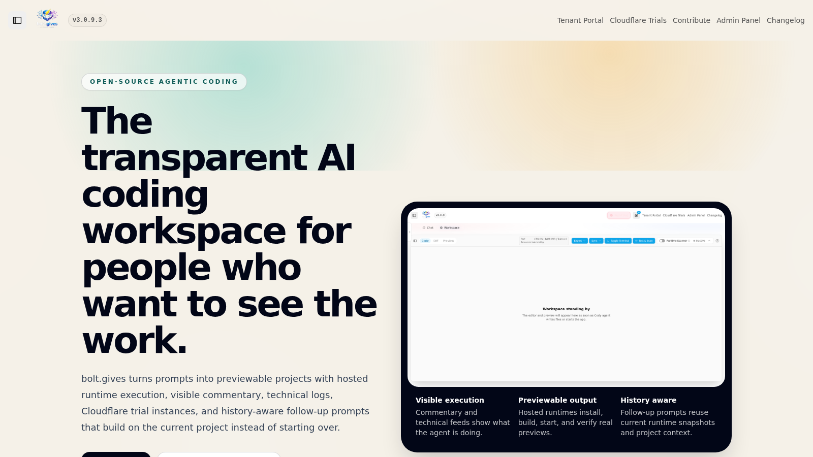
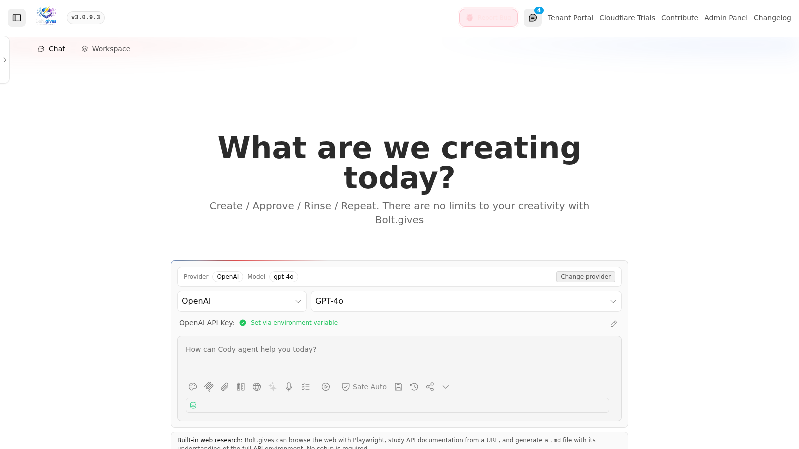
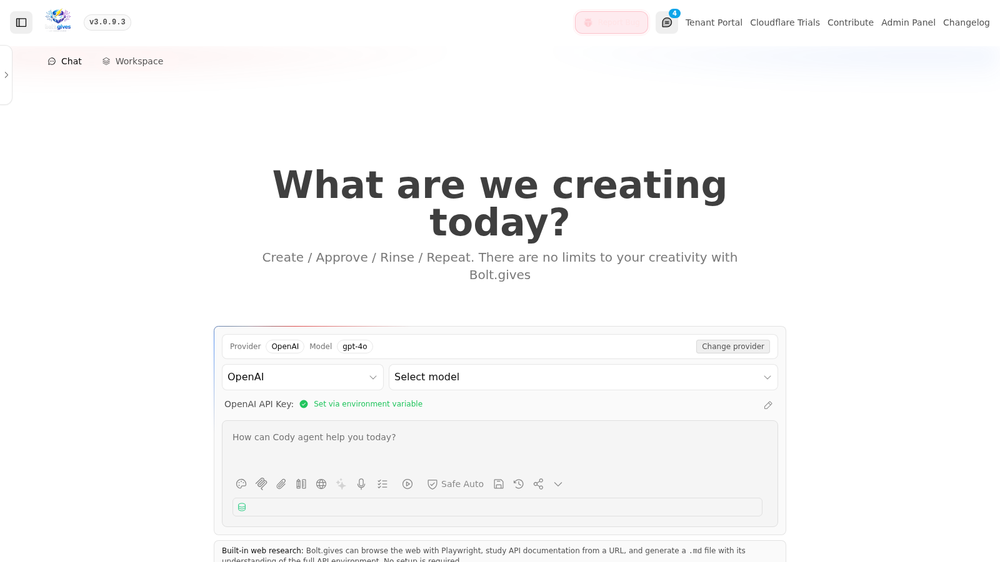
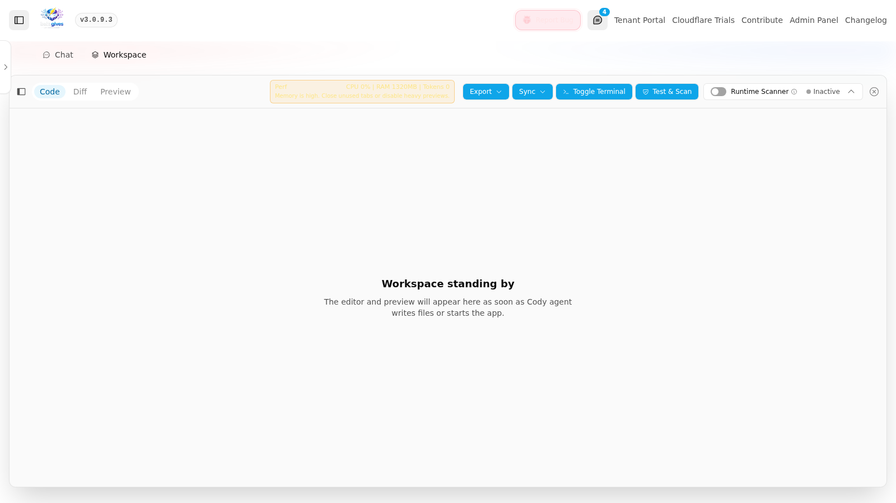
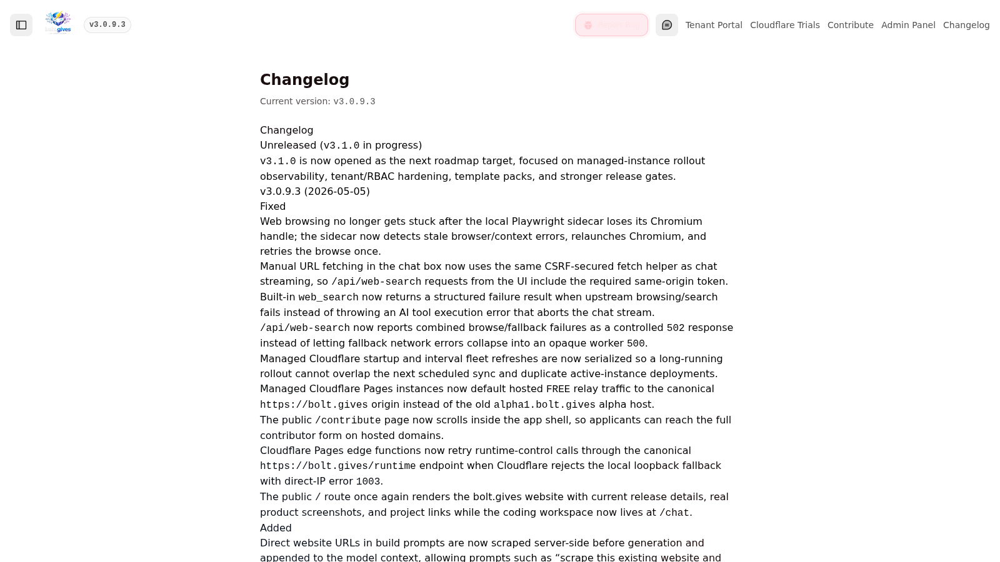

<p align="center">
  
</p>

<p align="center">
  collaborative, open-source ai coding workspace
</p>

<p align="center">
  <a href="https://bolt.gives">
    
  </a>
</p>

<p align="center">
  <a href="https://alpha1.bolt.gives">live alpha</a> ·
  <a href="https://create.bolt.gives">create a managed instance</a> ·
  <a href="https://bolt.gives/contribute">contribute</a> ·
  <a href="CHANGELOG.md">changelog</a> ·
  <a href="ROADMAP.md">roadmap</a> ·
  <a href="#installation-ubuntu-1804-only-verbose-tested">install</a>
</p>

## Start Here

- [Create a managed Cloudflare instance](https://create.bolt.gives)
- [Apply to become a contributor](https://bolt.gives/contribute)
- [Open the live alpha environment](https://alpha1.bolt.gives)
- [Review the roadmap](ROADMAP.md)
- [Read the changelog](CHANGELOG.md)

`create.bolt.gives` lands on the public `/managed-instances` registration flow. Users complete a short profile, including email address, request a preferred subdomain, and then receive a success page showing the live URL, assigned hostname, availability, and rollout state for the managed instance. The create flow is tuned for high-contrast readability so the public registration surface remains usable without theme tweaking. Those profile details are stored privately in the operator panel so admins can support and message clients when needed.

Managed instances serve their runtime preview through their own assigned hostname. The Pages deployment proxies `/runtime/*` to the hosted runtime control plane while preserving the instance origin, so users preview locally hosted workspace output at `https://<assigned-instance>/runtime/preview/...` and can publish publicly only when they choose to deploy.

Managed Pages instances also use `https://bolt.gives` as the canonical hosted `FREE` relay/control origin, so new trial instances do not inherit the older alpha host defaults.

Cloudflare Pages edge functions also retry runtime-control calls through `https://bolt.gives/runtime` when the edge rejects the local loopback fallback, which keeps public Pages previews from surfacing avoidable runtime-control console errors.

The public homepage at [`https://bolt.gives`](https://bolt.gives) is the project website. It highlights the current release, managed-instance flow, contributor pathway, real product screenshots, crawler-friendly structured data, and a generated search/social image at `/seo/bolt-gives-agentic-coding-platform.png`. The coding workspace is available at [`https://bolt.gives/chat`](https://bolt.gives/chat) and existing project chats continue to load at `/chat/:id`.

## Contribution Pathway

`bolt.gives` is open source and actively looking for contributors. Start at [`https://bolt.gives/contribute`](https://bolt.gives/contribute), complete the contributor application, and include:

- your full name and email address
- your GitHub username
- profile, portfolio, role, timezone, and availability details
- relevant experience with React, Remix, Cloudflare, runtime tooling, AI coding systems, design, testing, docs, or open-source maintenance
- the areas where you want to help
- why you want to become a `bolt.gives` contributor

Applications are sent to the operator inbox and applicants receive a formatted thank-you email when SMTP is configured. Approved contributors can open pull requests against the GitHub project, pick up roadmap-aligned issues, and help improve prompt-to-preview reliability, managed deployments, templates, self-hosting, documentation, and the visible execution experience.

The hosted contributor form scrolls inside the app shell, so applicants can reach the full form on desktop and mobile without losing the site header.

## Current Release (`v3.0.9.3`)

`v3.0.9.3` is the current stable hosted release. This patch restores web browsing reliability and makes direct website scrape-to-build prompts first-class: when a build prompt includes a public website URL, the server browses that page, extracts source copy/headings/links, and injects that context before generation so the new project can preserve useful data while producing original code and styling.

Large hosted model update: the managed `FREE` provider now uses OpenRouter model `deepseek/deepseek-v4-pro`, displayed as `DeepSeek V4 Pro`, through the protected server-side route. Managed instances and self-hosted deployments that configure `FREE_OPENROUTER_API_KEY` inherit that same locked model without exposing the operator-funded key to the browser.

`v3.0.9.2` restored managed Cloudflare trial coding by allowing credentialed hosted `FREE` relay calls through the server CSRF gate for chat routes, then verifying the shared relay secret through the runtime verifier before any model call is allowed. The compact Workspace Activity drawer from `v3.0.9.1` remains in place, so generated files and preview remain visible while live progress continues updating.

The hosted `FREE` path is locked to `DeepSeek V4 Pro` and stays server-side. Project creation now applies deterministic starter bootstrap for hosted FREE runs, syncs completed generated files into the managed runtime before preview verification, repairs common raw JSX angle text as files land, rejects incomplete/prose-only handoffs, waits for recovered preview states to settle, refuses package-only Vite autostarts before they can hold the session lock, and verifies real preview plus persisted runtime snapshot content with strict browser E2E coverage.

The browser startup path keeps preview/deploy controls out of the initial header chunk until chat starts. This preserves deploy access once a preview exists without reintroducing workbench initialization cycles during landing-page hydration.

Follow-up prompts are history-aware. They use a stable project-context id, deterministic current-workspace snapshots, hosted runtime snapshots as canonical file state, and a dedicated runtime shell so later prompts can improve the existing project instead of restarting from stale global memory. If preview recovery rolls back a broken follow-up, verification treats that as unfinished unless the latest generated files still persist in the runtime snapshot.

After a hosted preview is verified healthy, the active chat stream is allowed to finish instead of staying open for inspection-only recovery loops, so users can immediately send follow-up improvements against the current project.

Managed Cloudflare instances are registration-first, one-client / one-instance environments. Active and recoverable failed instances are refreshed from the current release SHA by the runtime rollout controller, automatic fleet refreshes are serialized to avoid overlapping startup/interval deployments, refreshes are health-verified before being marked active, and failed rollouts retain last-good SHA/deployment metadata for rollback decisions. New instances are spawned from the same live build plus the protected hosted FREE relay secret, and release validation creates a fresh instance through `https://create.bolt.gives` before verifying preview plus follow-up prompt behavior.

The operator surface at `admin.bolt.gives` includes client profile filtering/export, managed instance assignment state, fleet summary cards, deployment history, last-good SHA, healthcheck and rollback outcome visibility, SMTP configuration, audience-based email sends, bug reports, and rollout guard visibility. Self-hosting supports custom app/admin/create domains, local PostgreSQL, `psql`, operator credential seeding, Caddy-managed HTTPS, and a committed installer smoke command.

## Roadmap to v3.1.0

`v3.1.0` is the next platform-hardening release. The focus is managed-instance rollout observability, rollback, tenant/RBAC hardening, first-party template packs, stronger release gates, and continued browser-weight reduction.

### Launch blockers

- Add deployment history, last good SHA, health-verified refreshes, and rollback outcomes to the managed-instance/operator surfaces. Initial implementation is now in progress.
- Harden tenant/account lifecycle with production-safe auth, approval history, invite/reset flows, and RBAC. Privileged operator actions now refuse to run while the default admin password must still be changed.
- Ship first-party template packs plus CI smoke coverage so common app requests start from a reliable baseline. Initial pack criteria now cover appointment schedulers, dashboards, marketing sites, commerce catalogs, and portfolios; appointment scheduler prompts also receive a real first-pass React implementation before model continuation.
- Keep commentary task-specific in both `Chat` and `Workspace`, driven from real runtime/file/command events instead of generic filler.
- Reduce the remaining browser-heavy editor/PDF/git/terminal paths so long sessions stay responsive. The Preview workspace now gets a larger usable pane and a client bundle budget script is available.
- Keep the self-host installer resilient enough to recover from common package, dependency, build, and service-start failures without forcing the user to start over. `pnpm run smoke:self-host-installer` now validates the committed installer entry path.

### Key improvements planned

- Tighten Cloudflare managed-instance lifecycle around health-verified updates and rollback.
- Expand operator visibility inside `admin.bolt.gives` with trial capacity, deployment state, and outbound communication history.
- Keep the built-in `FREE` + `DeepSeek V4 Pro` path reliable across hosted, Pages, and managed instances.
- Continue moving heavy execution and reconciliation work off the browser and onto the server runtime.
- Keep docs and self-host setup short, direct, and launch-oriented.

## Current Platform Baseline (`v3.0.9.3`)

- Open-source AI coding workspace with transparent execution and visible agent actions.
- Hosted `FREE` provider ships locked to `DeepSeek V4 Pro` through a protected server-side OpenRouter route.
- Managed Cloudflare trial instances use the same protected hosted `FREE` relay path and can generate previewable apps plus follow-up improvements without requiring users to bring their own model API key.
- The live chat request path now uses the same protected CSRF handshake as the rest of the control plane, so hosted `FREE` project requests do not die at request start with a silent `403` before generation begins.
- The workspace shell now survives initial load reliably after the token-usage performance monitor was moved onto a stable external-store subscription instead of a hook path that could invalidate hydration.
- Managed hosted runtime handles installs, builds, tests, preview hosting, and file sync on live instances by default.
- Follow-up prompts on existing hosted projects now reuse validated runtime commands instead of stalling on prose-only model handoffs.
- Follow-up prompts now also reuse a stable project-context id and project-scoped memory, so the model stays aware of the current project instead of leaking context between unrelated chats.
- Current project files are now summarized deterministically even when context optimization is disabled, preserving “where am I in this codebase?” awareness on iterative edits and repair prompts.
- Local follow-up prompts now keep preview startup on a dedicated runtime shell, so dependency installs and restart commands can iterate on the same workspace without colliding with the running dev server.
- Local/self-host builds no longer trigger server-side “preview not verified” continuation loops after a valid generation, because that recovery path is now limited to hosted-runtime sessions the server can actually verify.
- The `/tenant` portal keeps account details and password forms scrollable inside the app shell, matching the global body-lock layout used by the workspace.
- Hosted file actions now target the active starter entry file even when the model chooses the wrong JS/TS sibling extension, so generated apps replace the fallback starter instead of being written into an inactive file.
- Hosted FREE preview verification now ignores stale fallback-starter detections once the synced workspace no longer contains the starter placeholder, which stops valid generated apps from being rolled back to an older starter snapshot.
- Hosted preview handoff now blocks incomplete starter rewrites from being treated as runnable projects, so the app continues generating until the active entry file actually contains the requested implementation instead of stalling with “preview verification is still pending.”
- Hosted preview handoff now also requires a concrete primary app entry file before setup/start commands are inferred, which stops starter-plus-support-file partial generations from being launched as if preview were ready.
- Hosted preview handoff also requires the assistant’s latest response to include a new concrete implementation file before synthetic setup/start commands can run, so stale request snapshots cannot turn scaffold-only output into a false preview-ready state.
- Local workbench preview startup syncs shell-created Vite files before React entry repairs and ignores commented-out default exports, which keeps first preview starts and follow-up repairs aligned with the actual filesystem.
- Manual follow-up prompts supersede queued Architect auto-heal work, so user-requested improvements do not race hidden recovery requests against the same runtime session.
- Hosted preview verification errors now trigger a concrete repair continuation, keeping follow-up prompts history-aware and self-healing when the preview remains unhealthy.
- Hosted runtime waits for completed file actions before syncing source into Vite, and recovered previews are not accepted as follow-up success if the rollback dropped the latest generated files.
- Hosted preview verification waits through `restored` recovery states before deciding another model continuation is needed, so valid recovered previews can close the current chat stream and accept follow-up prompts.
- Hosted runtime sync repairs raw JSX `<`/`>` button text before preview startup, avoiding a common DeepSeek syntax error that otherwise blocks live project creation.
- Hosted FREE preview verification now syncs generated file actions into the server runtime before health checks, so the verifier acts on the real current project rather than a partially synced workspace.
- Hosted runtime command replay now exits on the runtime `exit` event instead of waiting for the transport to close, preventing completed start commands from holding `/api/chat` streams open.
- Hosted runtime preview startup probes the reserved preview port immediately and marks package-only Vite workspaces as incomplete, preventing quiet dev-server starts from idling until the runtime command timeout.
- Hosted runtime preview autostart refuses package-only Vite workspaces before opening a runtime command stream, preventing incomplete snapshots from holding the session operation lock ahead of the real generated file handoff.
- Hosted runtime startup repairs common raw JSX angle text emitted by smaller models, so navigation buttons like `<` and `>` do not block Vite preview creation.
- Local self-host CSP now allows the loopback preview/provider sockets that WebContainer-based runs actually use on `localhost` and `127.0.0.1`, while avoiding invalid `[::1]` policy entries that generated fresh browser console errors.
- Hosted preview verification now streams visible startup progress while the server waits for the managed preview to turn healthy, which keeps long warm-ups readable instead of going silent and makes disconnect recovery less opaque.
- The Workspace preview now re-checks hosted preview state immediately on iframe load, so generated apps replace the fallback starter much sooner on live domains.
- Browser E2E coverage now treats “working project” strictly: the generated app has to render the requested prompt token in preview before the smoke passes.
- File and shell action failures now reject to the active caller while the execution queue continues, so blocked writes and runtime failures surface as failed project creation instead of quiet success.
- `Chat` and `Workspace` are separate top-level tabs, with a compact `Workspace Activity` area for commentary and execution state that does not crowd out generated files and preview.
- Managed Cloudflare instances are registration-first, one-client / one-instance environments with preferred-subdomain support and private client profile capture.
- `admin.bolt.gives` provides the private operator panel for client profiles, managed-instance assignments, filtered profile export, audience-based operator email sends, and admin email activity.
- The live console now includes an in-app `Report Bug` control that captures the reporter’s full name, reply email, and issue summary, stores the report privately in PostgreSQL, and routes a formatted operator notification without exposing server-side credentials.
- `admin.bolt.gives` now also includes a real SMTP configuration form, so operators can save or clear the outgoing mail transport from the admin panel without editing server env files by hand. Stored credentials remain server-side only and the browser only ever sees masked transport metadata.
- The admin surface is now structured as an operator dashboard with sticky sidebar navigation, section anchors, grouped KPI cards, and clearly separated panels for tenants, client profiles, managed instances, and outreach.
- The operator dashboard uses stable UTC timestamp rendering, so the authenticated admin panel stays intact after hydration instead of collapsing on locale mismatches.
- Header-level `Shout Out Box` messaging lets users on the same deployment broadcast short updates to other active users, with an unread badge and a per-user settings toggle.
- Managed-instance rollout now refuses to start when the live runtime checkout is behind `origin/main`, which prevents silent stale-fleet refreshes from the wrong git SHA.
- Self-hosting supports custom app/admin/create domains, local PostgreSQL, and Caddy-managed HTTPS.


## Screenshots

Home:


Chat:


Plan prompt example:


Workspace:


Changelog:


## Installation (Ubuntu 18.04+ Only, Verbose, Tested)

This installation path is designed to let users self-host the full product on their own VPS:

- public app domain
- public admin/operator domain
- optional public create/trial-registration domain
- local PostgreSQL for the private admin/control-plane data
- Caddy-managed HTTPS on the chosen domains

Core coding stays open source and self-hostable. Sensitive server-side keys stay in `.env.local` and never need to be exposed to browser users.

### 0. What you need

- Ubuntu `18.04+` (recommended `22.04+`)
- A user account with `sudo` access
- Internet access for package installation and GitHub clone
- Public DNS A records for the domains the user wants to use, all pointing at the VPS IP

Recommended self-host domain layout:

- app: `code.example.com`
- admin: `admin.example.com`
- create: `create.example.com`

The `create` domain is optional. If it is omitted, the registration flow still works at:

- `https://<app-domain>/managed-instances`

Windows/macOS note:

- You can use bolt.gives in the browser on Windows/macOS.
- You should install/self-host bolt.gives on Ubuntu 18.04+.

### 1. Recommended: run the installer

Download the installer from GitHub, inspect it, then run it.

Simplest path:

```bash
curl -fsSL https://raw.githubusercontent.com/embire2/bolt.gives/main/install.sh -o install-bolt-gives.sh
chmod +x install-bolt-gives.sh
./install-bolt-gives.sh
```

If you run it without domain, PostgreSQL, or operator-credential flags, the installer now prompts interactively for the missing values.

Fully explicit path:

```bash
curl -fsSL https://raw.githubusercontent.com/embire2/bolt.gives/main/install.sh -o install-bolt-gives.sh
chmod +x install-bolt-gives.sh
./install-bolt-gives.sh \
  --app-domain code.example.com \
  --admin-domain admin.example.com \
  --create-domain create.example.com
```

The installer will:

- install `git`, `curl`, `ca-certificates`, and `build-essential`
- install `python3`
- install Node.js `22.x`
- install a compatible `pnpm 9.x` release (repo-pinned to `9.14.4`)
- install local `PostgreSQL`, `psql`, and create a dedicated local admin/control-plane database
- install `Caddy` and configure HTTPS reverse-proxy blocks for the chosen public domains
- clone or update `https://github.com/embire2/bolt.gives`
- create `.env.local` from `.env.example` if it does not exist
- write self-host public URLs into `.env.local` for:
  - `BOLT_APP_PUBLIC_URL`
  - `BOLT_ADMIN_PANEL_PUBLIC_URL`
  - `BOLT_CREATE_TRIAL_PUBLIC_URL`
- write local PostgreSQL connection settings into `.env.local` for:
  - `BOLT_ADMIN_DATABASE_HOST`
  - `BOLT_ADMIN_DATABASE_PORT`
  - `BOLT_ADMIN_DATABASE_NAME`
  - `BOLT_ADMIN_DATABASE_USER`
  - `BOLT_ADMIN_DATABASE_PASSWORD`
  - `BOLT_ADMIN_DATABASE_SSL=disable`
- generate a private `BOLT_TENANT_ADMIN_COOKIE_SECRET`
- seed the private tenant registry with your chosen operator/admin username and password hash on first install
- build the app with a **4 GB** Node heap (`NODE_OPTIONS=--max-old-space-size=4096`)
- install and start these systemd services:
  - `bolt-gives-app`
  - `bolt-gives-collab`
  - `bolt-gives-webbrowse`
  - `bolt-gives-runtime`

The `bolt-gives-app` launcher health-checks the local Wrangler Pages listener and forces a failed exit when it stops responding, so systemd restarts the app service instead of leaving Caddy pointed at a dead origin.

If the domain or PostgreSQL flags are omitted, the installer now prompts interactively for:

- public app domain
- public admin domain
- optional public create/trial domain
- Let's Encrypt contact email
- local PostgreSQL database name
- local PostgreSQL user
- optional local PostgreSQL password (blank = generated)
- private operator/admin username
- private operator/admin password

If a recoverable step fails, the installer now retries and repairs the common failure paths before giving up:

- apt / dpkg state
- pnpm dependency install state
- build artifacts and Vite cache
- service startup and first HTTP health check

Recommended real-world installer command:

```bash
curl -fsSL https://raw.githubusercontent.com/embire2/bolt.gives/main/install.sh -o install-bolt-gives.sh
chmod +x install-bolt-gives.sh
./install-bolt-gives.sh \
  --app-domain code.example.com \
  --admin-domain admin.example.com \
  --create-domain create.example.com \
  --postgres-db bolt_gives_admin \
  --postgres-user bolt_gives_admin
```

Optional overrides:

```bash
INSTALL_DIR="$HOME/apps/bolt.gives" ./install-bolt-gives.sh
```

After the installer finishes:

- app: `http://127.0.0.1:5173`
- collaboration server: `ws://127.0.0.1:1234`
- web browsing service: `http://127.0.0.1:4179`
- runtime control plane: `http://127.0.0.1:4321`
- admin panel: `https://admin.example.com` (or whatever `--admin-domain` was set to)
- trial registration: `https://create.example.com` (or `https://<app-domain>/managed-instances` if `--create-domain` was omitted)
- operator login: `https://admin.example.com/tenant-admin` using the private username/password you chose during install

The raw operator password is never committed and is not stored in browser code. The installer hashes it into the local tenant registry on your VPS so the self-hosted admin panel does not fall back to the insecure bootstrap `admin / admin` default.

### 2. Add your provider keys

The installer creates `.env.local` for you. Edit it after install:

```bash
cd ~/bolt.gives
nano .env.local
```

Then restart the services:

```bash
sudo systemctl restart bolt-gives-app bolt-gives-collab bolt-gives-webbrowse bolt-gives-runtime
```

bolt.gives core still does not require an external hosted database, but the full self-hosted operator stack now supports a local PostgreSQL service for:

- registered client profiles
- managed Cloudflare trial assignments
- admin/operator email activity

Important:

- keep `FREE_OPENROUTER_API_KEY` on the server only
- keep any `OPENAI_API_KEY`, `OPEN_ROUTER_API_KEY`, or other provider secrets on the server only unless the user intentionally wants browser-local key entry
- never commit `.env.local`

Hosted-instance note:

- If you run a managed/shared instance, you can define `FREE_OPENROUTER_API_KEY` server-side to expose a locked hosted coder without exposing the token to users.
- Keep `OPEN_ROUTER_API_KEY` unset on hosted/shared instances if you want the public `OpenRouter` provider to remain user-supplied.
- The hosted `FREE` coder is pinned to `deepseek/deepseek-v4-pro`. If that protected route is unavailable, the UI surfaces a clear retry/switch-provider error instead of silently routing to another model.
- Managed Cloudflare instances do not receive the OpenRouter key itself. They receive a server-only relay secret on the Pages project, and the live app relays hosted FREE requests back to the operator runtime without exposing the upstream token.
- Hosted FREE relay authorization now falls back to the local runtime service on the operator host, so the built-in `DeepSeek V4 Pro` path keeps working on Pages-hosted managed trials without asking the user for their own API key.
- Chat history persistence is browser-only and initializes only when IndexedDB exists, so Cloudflare/SSR rendering does not try to open client storage.
- Hosted preview autostart waits for the managed runtime `ready` event before reporting success, which keeps live follow-up prompts attached to a verified current project instead of a preview stuck in `starting`.
- Live browser E2E checks now require generated and follow-up tokens to persist in the hosted runtime snapshot, with bounded snapshot/status fetch timeouts so release validation cannot hang silently.

### 3. Verify the install

```bash
sudo systemctl status bolt-gives-app --no-pager
sudo systemctl status bolt-gives-collab --no-pager
sudo systemctl status bolt-gives-webbrowse --no-pager
sudo systemctl status bolt-gives-runtime --no-pager
sudo systemctl status postgresql --no-pager
sudo systemctl status caddy --no-pager
```

Open `http://127.0.0.1:5173`, then verify:

- UI loads without a server crash
- chat opens
- terminal and preview panels render
- collaboration and web browsing helper services are reachable
- the admin domain loads the tenant/operator panel
- the create domain loads the managed trial registration form

Recommended public checks after DNS is pointed:

- `https://code.example.com`
- `https://admin.example.com`
- `https://create.example.com`

If the user skips a dedicated create domain, the installer falls back to:

- `https://code.example.com/managed-instances`

### 4. Manual install alternative

If you do not want to use the installer, this is the validated manual path for users who want to provision everything themselves.

```bash
sudo apt-get update
sudo apt-get install -y git curl ca-certificates build-essential python3 postgresql postgresql-client postgresql-contrib caddy
curl -fsSL https://deb.nodesource.com/setup_22.x | sudo -E bash -
sudo apt-get install -y nodejs
sudo npm install -g pnpm@9.14.4
git clone https://github.com/embire2/bolt.gives.git
cd bolt.gives
cp .env.example .env.local
sudo -u postgres createuser --pwprompt bolt_gives_admin
sudo -u postgres createdb --owner=bolt_gives_admin bolt_gives_admin
cat >> .env.local <<'EOF'
BOLT_ADMIN_PANEL_PUBLIC_URL=https://admin.example.com
BOLT_CREATE_TRIAL_PUBLIC_URL=https://create.example.com
BOLT_ADMIN_DATABASE_HOST=127.0.0.1
BOLT_ADMIN_DATABASE_PORT=5432
BOLT_ADMIN_DATABASE_NAME=bolt_gives_admin
BOLT_ADMIN_DATABASE_USER=bolt_gives_admin
BOLT_ADMIN_DATABASE_PASSWORD=replace_me
BOLT_ADMIN_DATABASE_SSL=disable
EOF
pnpm install --frozen-lockfile || pnpm install
NODE_OPTIONS=--max-old-space-size=4096 pnpm exec remix vite:build
```

Run it locally:

```bash
# terminal 1
NODE_OPTIONS=--max-old-space-size=4096 pnpm run collab:server

# terminal 2
NODE_OPTIONS=--max-old-space-size=4096 pnpm run webbrowse:server

# terminal 3
NODE_OPTIONS=--max-old-space-size=4096 pnpm run start
```

Then place Caddy in front of the app with the chosen domains:

```caddyfile
code.example.com {
  encode zstd gzip
  header {
    Cache-Control "no-store, max-age=0, must-revalidate"
  }

  handle /runtime/* {
    reverse_proxy 127.0.0.1:4321
  }

  handle_path /collab/* {
    reverse_proxy 127.0.0.1:1234
  }

  handle {
    reverse_proxy 127.0.0.1:5173
  }
}

admin.example.com {
  encode zstd gzip
  @root path /
  redir @root /tenant-admin 302

  handle /runtime/* {
    reverse_proxy 127.0.0.1:4321
  }

  handle_path /collab/* {
    reverse_proxy 127.0.0.1:1234
  }

  handle {
    reverse_proxy 127.0.0.1:5173
  }
}

create.example.com {
  encode zstd gzip
  @root path /
  redir @root /managed-instances 302

  handle /runtime/* {
    reverse_proxy 127.0.0.1:4321
  }

  handle_path /collab/* {
    reverse_proxy 127.0.0.1:1234
  }

  handle {
    reverse_proxy 127.0.0.1:5173
  }
}
```

### 5. Contributor note about memory

The repo still contains heavier maintainer scripts used for large local test/build workflows.  
The installer and manual self-host path above are the validated open-source install path and run with a **4 GB** Node heap.

## Deploying To Cloudflare Pages (Verbose, Step By Step)

This is the **supported self-service Cloudflare path that works today**.

What this gives the user right now:

- their own isolated Cloudflare Pages deployment
- their own chosen `*.pages.dev` project name
- optional custom domain after the first deploy
- automatic redeploys from GitHub when they push updates

What this does **not** give yet:

- live managed trial provisioning on a runtime that does not have `CLOUDFLARE_API_TOKEN` and `CLOUDFLARE_ACCOUNT_ID` configured

The managed trial control plane is now part of the product under `/managed-instances`. It becomes operational on a given deployment only when the runtime has the required Cloudflare credentials configured.

### 1. Prerequisites

Before starting, the user needs:

- a Cloudflare account
- a GitHub account
- a fork or clone of `https://github.com/embire2/bolt.gives`
- Node.js `22.x` and `pnpm 9.x` locally if they want to test before connecting Git

### 2. Prepare the repo

If the user wants to test locally first:

```bash
git clone https://github.com/embire2/bolt.gives.git
cd bolt.gives
pnpm install
NODE_OPTIONS=--max-old-space-size=6142 pnpm run build
```

This repo is already configured for Cloudflare Pages in `wrangler.toml`:

- build output directory: `build/client`
- Pages Functions entry: `functions/[[path]].ts`
- compatibility flag: `nodejs_compat`

### 3. Create the Pages project in Cloudflare

In the Cloudflare dashboard:

1. Open `Workers & Pages`
2. Click `Create`
3. Choose `Pages`
4. Choose `Connect to Git`
5. Select the GitHub repository the user wants to deploy

The **project name** becomes the default `*.pages.dev` subdomain.

Example:

- project name: `my-bolt-gives`
- default URL: `https://my-bolt-gives.pages.dev`

If the user wants a different public URL later, they can attach a custom domain after the first successful deploy.

### 4. Use these exact Cloudflare build settings

Use the following values in the Cloudflare Pages setup form:

- Framework preset: `None`
- Root directory: `/`
- Build command: `NODE_OPTIONS=--max-old-space-size=6142 pnpm run build`
- Build output directory: `build/client`

Do **not** point Pages at another output folder. This project expects `build/client`.

### 5. Set the required environment variables in Pages

In Cloudflare Pages, open:

- `Settings`
- `Environment variables`

Set at least:

- `NODE_OPTIONS=--max-old-space-size=6142`

Optional, depending on how they want the AI runtime to behave:

- `FREE_OPENROUTER_API_KEY=...`
  - Use this only if they want the built-in hosted `FREE` provider to work on **their** deployment.
  - This stays server-side in Cloudflare. It is **not** exposed to browser users.
  - The shipped FREE path is locked to `deepseek/deepseek-v4-pro`.
- `OPENAI_API_KEY=...`
  - Optional if they want OpenAI available server-side by default on their own instance.
- `OPEN_ROUTER_API_KEY=...`
  - Optional for their own OpenRouter-backed server-side use cases.
  - Leave this unset if they want OpenRouter to remain entirely user-supplied in the UI.

Important:

- The open-source app does **not** expose `FREE_OPENROUTER_API_KEY` to end users.
- If a user wants their deployment to ship with a working FREE coder immediately after install, they need to set `FREE_OPENROUTER_API_KEY` in Cloudflare for their own project.

### 6. First deploy

Once the Git repo and build settings are connected:

1. Click `Save and Deploy`
2. Wait for the build to complete
3. Open the generated `*.pages.dev` URL

On first load, the expected default UX is:

- land on `Chat`
- provider already set to `FREE`
- model label already showing `DeepSeek V4 Pro`

### 7. Give the user their own subdomain

Users have two options:

1. Use their Cloudflare Pages project name as the default subdomain
   - example: `clinic-bolt.pages.dev`
2. Attach a custom domain in:
   - `Workers & Pages`
   - selected project
   - `Custom domains`

That means users can already choose their own public address today without waiting for the future managed trial control plane.

### 8. Automatic updates from GitHub

If the project is connected through Cloudflare Pages Git integration:

- every push to the configured branch triggers a new deployment automatically
- this is the easiest way to keep the instance updated from GitHub

If they want the production instance to track stable releases only:

- connect Pages to `main`

If they want a soak-test instance:

- connect a separate Pages project to `alpha`

### 9. Troubleshooting memory or build failures

If the build runs out of memory:

- confirm `NODE_OPTIONS=--max-old-space-size=6142` is set in Pages
- confirm the build command is exactly:
  - `NODE_OPTIONS=--max-old-space-size=6142 pnpm run build`

If the UI loads but the FREE provider does not work:

- confirm `FREE_OPENROUTER_API_KEY` is set in the Cloudflare Pages environment
- redeploy the project after saving env changes
- for managed Cloudflare instances, refresh the deployment from the operator/runtime control plane so the Pages relay secret is applied; end users should never need to enter a FREE API key manually

If the deploy succeeds but the URL still shows an older release:

- open the latest deployment in Pages
- confirm the connected Git branch and latest commit SHA
- trigger a redeploy from the newest commit

### 10. About the managed Cloudflare instance program

The shipped control-plane model is:

- free experimental shared runtime while capacity lasts
- future Pro from `$12/month` with more tools and higher limits

The shipped control plane now covers:

- user signs into bolt.gives
- user completes a short managed-instance profile, including email address
- the operator panel stores that client profile privately for support and messaging
- user requests a managed Cloudflare instance
- bolt.gives enforces one-client / one-instance ownership
- user chooses a subdomain
- the managed instance is currently available indefinitely unless the operator suspends it
- updates can roll forward from the current stable build through the runtime sync path

What still remains:

- live operator credential enablement on every managed runtime
- rollback verification on failed managed-instance updates
- deeper operator observability for managed-instance rollout state

Fresh install checklist:

- `docs/fresh-install-checklist.md`

## Built-In Web Browsing

bolt.gives can now browse docs from user prompts like:

- `Study these API documentation: https://developers.cloudflare.com/workers/`
- `Scrape https://example.com and build me a modern replacement website using its services, copy, and navigation data.`

How it works:

- The model uses built-in tools: `web_search` and `web_browse`.
- `web_browse` reads the target URL with Playwright and extracts title, headings, links, and body content.
- Direct public URLs in build prompts are also browsed before generation, and the extracted source context is appended to the model request automatically.
- If the Playwright browser handle goes stale, the browse sidecar relaunches Chromium and retries once instead of returning a persistent closed-browser `500`.
- The model can then create a Markdown study file directly in the workspace using `<boltAction type="file">`.

Configuration:

- `WEB_BROWSE_SERVICE_URL` (optional): URL for the browsing service.
  - Default: `http://127.0.0.1:4179`
- Browser install is handled during dependency install (`pnpm install`) via postinstall.
  - To skip browser download: `PLAYWRIGHT_SKIP_BROWSER_DOWNLOAD=1 pnpm install`

## Real-Time Collaboration

The editor uses Yjs and connects to a local `y-websocket` compatible server.

- Server script: `scripts/collaboration-server.mjs`
- Default WS URL: `ws://localhost:1234`
- Default persistence directory: `.collab-docs` (override with `COLLAB_PERSIST_DIR`)

Client settings (stored in browser localStorage):

- `bolt_collab_enabled` (defaults to enabled when unset)
- `bolt_collab_server_url` (defaults to `ws://localhost:1234`)

## Screenshots (Reproducible)

To refresh the screenshots used in this README:

```bash
./scripts/capture-screenshots.sh
```

Outputs:

- `docs/screenshots/home.png`
- `docs/screenshots/chat.png`
- `docs/screenshots/chat-plan.png`
- `docs/screenshots/system-in-action.png`
- `docs/screenshots/changelog.png`

To capture screenshots from the live alpha environment instead of a local dev server:

```bash
SKIP_DEV_SERVER=1 BASE_URL=https://alpha1.bolt.gives ./scripts/capture-screenshots.sh
```

To generate a shared-session restore screenshot (requires Supabase configured in `.env.local`):

```bash
node scripts/e2e-sessions-share-link.mjs
```

## Validation Gate

Before pushing changes:

```bash
pnpm run typecheck
pnpm run lint
pnpm test
pnpm run gate:release:live
```

`gate:release:live` checks:

- both live domains (`alpha1.bolt.gives` and `ahmad.bolt.gives`) return healthy pages
- live version + changelog version match `package.json`
- screenshot capture assertions pass (no server-error capture states, expected dimensions, non-empty output)

## Docker Images (GHCR)

This repo includes a `Docker Publish` GitHub Actions workflow that can build and (optionally) push images to GitHub Container Registry.

By default, publishing is disabled. To enable pushing to GHCR:

1. Create an Actions variable: `GHCR_PUSH_ENABLED=true`
2. (Optional) Create an Actions secret: `GHCR_PAT` with `read:packages` and `write:packages`

Notes:

- If `GHCR_PAT` is not set, the workflow will fall back to the built-in `GITHUB_TOKEN`.
- Images publish to `ghcr.io/<owner>/<repo>`.

## Contributing (Fork + PR Workflow)

We follow a standard GitHub fork + PR workflow.

1. Fork this repository on GitHub.
2. Clone your fork locally:
   ```bash
   git clone https://github.com/<your-username>/bolt.gives.git
   cd bolt.gives
   ```
3. Add the upstream remote:
   ```bash
   git remote add upstream https://github.com/embire2/bolt.gives.git
   git fetch upstream
   ```
4. Create a branch off `main`:
   ```bash
   git checkout -b feat/my-change
   ```
5. Make changes and run the validation gate:
   - `pnpm run typecheck`
   - `pnpm run lint`
   - `pnpm test`
6. Push your branch to your fork and open a Pull Request targeting `embire2/bolt.gives:main`.

PR expectations:

- Keep PRs focused (one feature/bugfix per PR).
- Explain what changed, why, and how reviewers can verify it.
- Do not commit secrets. Put keys in `.env.local` (gitignored).

## License

MIT
